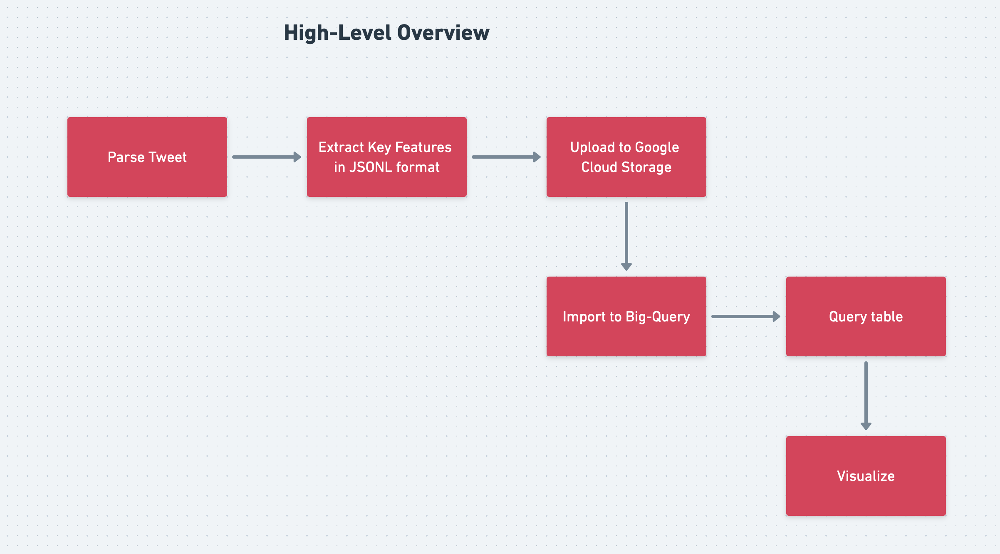
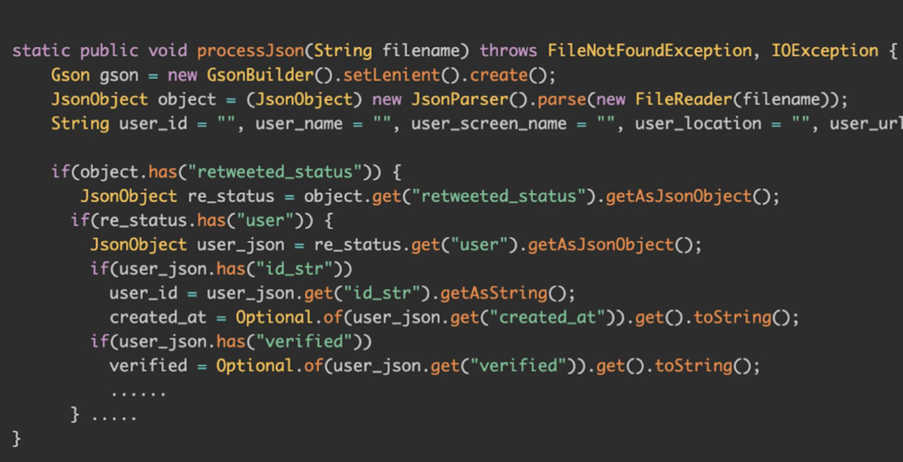
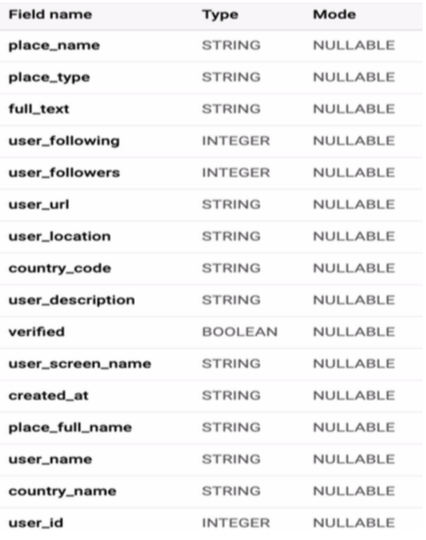
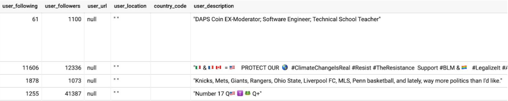
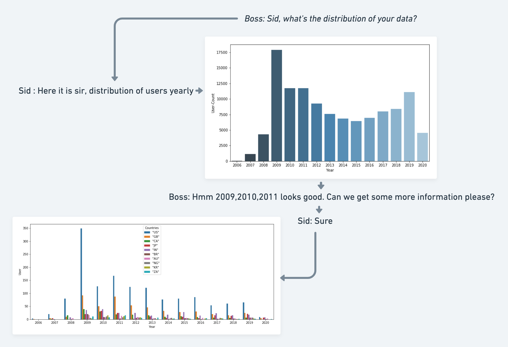
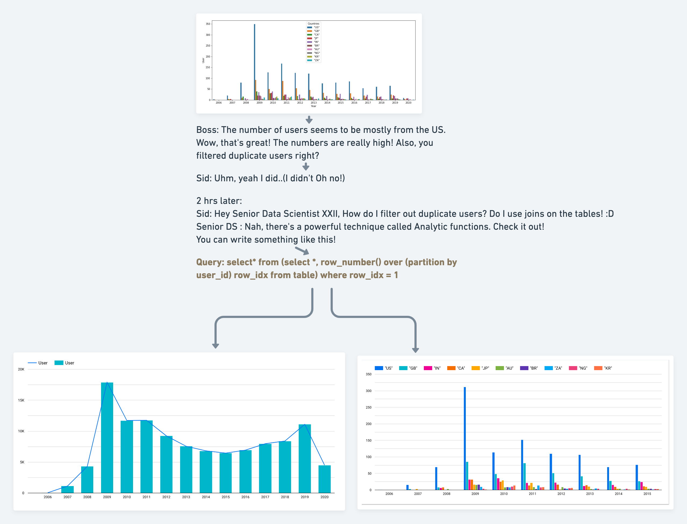
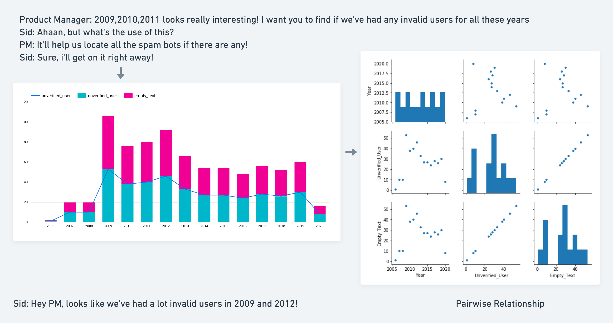
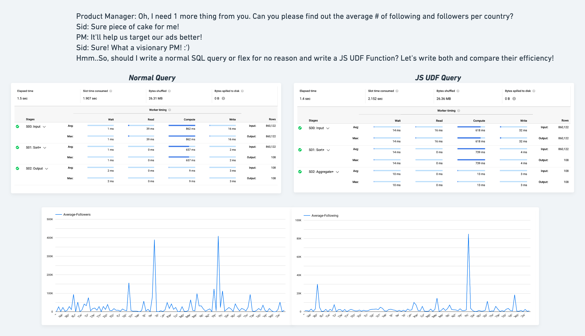
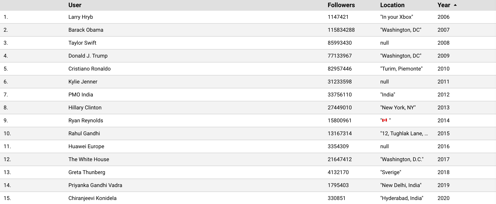

## Motivation

Billions of users use the social network, which means billions of data is available on the internet. Twitter being one of the social network giants is one of the famous platforms for people to rant, provide insights on unnecessary topics, bash each other, talk about politics, and many more. Primary motivation for choosing the twitter dataset is to analyse the dynamics and structure of the modern society. Almost every active twitter user’s thinking about a certain topic can be altered via fake news. My analysis of the dataset is to find patterns within countries.


### About the data
* The tweets were extracted via [Twitter API](https://developer.twitter.com/en/docs) and [Tweepy](https://www.tweepy.org/)
* Data Format : JSONL

### Obtaining the data
* Wrote a Python script to parse tweets.
* Around 30k-100k tweets were extracted per day.

#### Code Snippet: [link](https://github.com/siddhartha97/Twitter-Data-Analysis/blob/master/Scripts/parse_tweet.py)

```
import​ time
import​ twitter_credential
from​ tweepy ​import​ Stream
from​ tweepy ​import​ OAuthHandler
from​ tweepy.streaming ​import​ StreamListener

class​ ​StdOutListener​(StreamListener)​:
  global​ ct
  ct = ​0
  def​ ​on_data​(self, data)​: 
    ts = time.time()
    global​ ct
    ct=ct + ​1
    print(​"Fetching Tweet #:"​, ct)
    with​ open(​"Files/"​ + ​"tweet_"​ + str(ts) + ​".json"​, "​ w"​) ​as​ tf:
                      tf.write(data)
    return​ ​True
  def​ ​on_error​(self, status)​:
    print(status)
```
### Preprocessing
* Used GSON Parser to parse the Json object and extract important key-values such as *(user_name: “Something”, user_screen_name : “loremipsum”, user_location:
“loremipsum1”)*
* Each Json was stored as a class and written into a file as JSONL format.

#### Code Snippet:[link](https://github.com/siddhartha97/Twitter-Data-Analysis/blob/master/Pipeline/java/dataflow/src/main/java/edu/usfca/dataflow/Main.java)


### Google Big-Query: 
* Current File Format: JSONL
* Since the size of the file was > 10Mb, we cannot directly upload the JSONL File.
* File was loaded to Google Cloud Storage and then written to Google Big Query. 

#### Command-Line Argument: 
```
gs util cp *.jsonl gs://my-bucket 
```

### Table Schema: 
```
Add images
```
### Data Snippet: 
```
Add data
```
### Shape of the data: 
```
1. Add distribution of data
2. Add distribution country wise
3. Remove any duplicates using Analytic Function (provide snippet)
4. Provide invalid user chart and pairwise relationship
5. Provide most popular apps and mention that the result was inconclusive. 
6. Find average user following country wise and provide the udf code snippet.
```
#### Schema of Table

#### Data Snippet

#### Story-Board
* Welcome to a day in the life of a new grad Data Scientist Sid who has no clue what he is doing! 
* Enjoy the conversation between him and his manager! 
* This is his first job straight outta college! 




### Most Followed User Yearly


```
code snippet for average followers country wise and compare the efficiency for udf and normal
```
