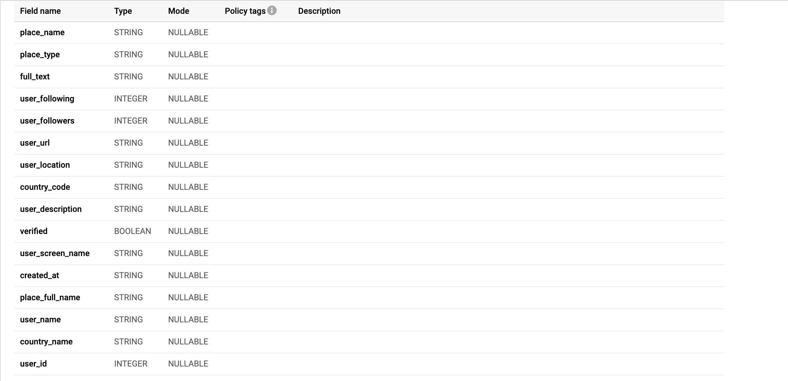

## Motivation

Billions of users use the social network, which means billions of data is available on the internet. Twitter being one of the social network giants is one of the famous platforms for people to rant, provide insights on unnecessary topics, bash each other, talk about politics, and many more. Primary motivation for choosing the twitter dataset is to analyse the dynamics and structure of the modern society. Almost every active twitter user’s thinking about a certain topic can be altered via fake news. My analysis of the dataset is to find patterns within countries and users.


### About the data
The data was gathered by writing a Python script which uses [Twitter API](https://developer.twitter.com/en/docs) and [Tweepy](https://www.tweepy.org/) to extract individual tweets. Twitter requires one to create a Twitter Developer account after which you can receive the authorization key and password to extract data. The tweets are of *JSON* format. A sample of the json file can be found [here](https://pastebin.com/SrVfQ7n4). 

### Obtaining the data
* Wrote a Python script to parse tweets.
* The individual tweets were stored locally in a directory before uploading it to Google Cloud Storage.
* Around 30k-100k tweets were extracted per day.

#### Code Snippet: [link](https://github.com/siddhartha97/Twitter-Data-Analysis/blob/master/Scripts/parse_tweet.py)

```
import​ time
import​ twitter_credential
from​ tweepy ​import​ Stream
from​ tweepy ​import​ OAuthHandler
from​ tweepy.streaming ​import​ StreamListener

class​ ​StdOutListener​(StreamListener)​:
  global​ ct
  ct = ​0
  def​ ​on_data​(self, data)​: 
    ts = time.time()
    global​ ct
    ct=ct + ​1
    print(​"Fetching Tweet #:"​, ct)
    with​ open(​"Files/"​ + ​"tweet_"​ + str(ts) + ​".json"​, "​ w"​) ​as​ tf:
                      tf.write(data)
    return​ ​True
  def​ ​on_error​(self, status)​:
    print(status)
```
### Pre-processing
* Used GSON Parser to parse the Json object and extract important key-values such as *(user_name: “Something”, user_screen_name : “loremipsum”, user_location:
“loremipsum1”)*
* Each Json was stored as a class and written into a file as JSONL format.

#### Code Snippet: [link](https://github.com/siddhartha97/Twitter-Data-Analysis/blob/master/Pipeline/java/dataflow/src/main/java/edu/usfca/dataflow/Main.java)
```
 static public void processJson(String filename) {
   Gson gson = new GsonBuilder().setLenient().create();
   JsonObject object = (JsonObject) new JsonParser().parse(new FileReader(filename));
   String user_id = "", user_name = "";
   String user_screen_name = "", user_location = "", user_url = "";
   if(object.has("retweeted_status")) {
       JsonObject re_status = object.get("retweeted_status").getAsJsonObject();
      if(re_status.has("user")) {
        JsonObject user_json = re_status.get("user").getAsJsonObject();
        if(user_json.has("id_str"))
          user_id = user_json.get("id_str").getAsString();
        if(user_json.has("name"))
          user_name = user_json.get("name").getAsString();
        ....
     }
 }
```

### Google Big-Query: 
* Current File Format: JSONL.
* Since the size of the file was > 10MB, we cannot directly upload the JSONL File.
* File was loaded to Google Cloud Storage and then written to Google Big Query. 

#### Command-Line Argument: 
```
gs util cp *.jsonl gs://my-bucket 
```
#### Schema of Table

#### Data Snippet

### Story-Board:
```
* Welcome to a day in the life of a new grad Data Scientist Sid! 
* Enjoy the conversation between him, his manager and a PM! 
* This is his first job straight out of college! 
```


<iframe style="border:none" width="800" height="450" src="https://whimsical.com/embed/RNeqoZj8GeZyZh7HVNdbg6#2Ux7TurymR4ynppBR5sX"></iframe>

<iframe style="border:none" width="800" height="450" src="https://whimsical.com/embed/WVB65X6AswxoHf6NRTfL9i#2Ux7TurymMkhLwaGStnm"></iframe>

<iframe style="border:none" width="800" height="450" src="https://whimsical.com/embed/9Hcr66RyuRMrQWgbwMpWcc#2Ux7TurymNDXVqGDQFL5"></iframe>

<iframe style="border:none" width="800" height="450" src="https://whimsical.com/embed/7mTNcYUmovVrSTqX2GBg8q#2Ux7TurymNBUosUW4x3j"></iframe>


* It's important to note that the UDF Function is using an extra step called `Aggregation` and also the `Sort` step doesn't seem any faster.
* Looks like the *Normal Query* is more efficient! 
* Queries: 
##### Simple Query:
```
SELECT
  country_code,
  u_followers/u_id AS avg_followers,
  u_following/u_id AS avg_following
FROM (
  SELECT
    country_code,
    SUM(user_followers) AS u_followers,
    SUM(user_following) AS u_following,
    COUNT(user_id) AS u_id
  FROM
    unique_table
  WHERE
    country_code != ""
  GROUP BY
    country_code)
```
##### JS UDF Query: 
```
CREATE TEMP FUNCTION
  solve(param ARRAY<STRUCT<user_followers INT64,
    user_following INT64>>)
  RETURNS STRUCT<avg_follower INT64,
  avg_following INT64>
  LANGUAGE js AS """
  var len = param.length;
  var following_ct = 0;
  var follower_ct = 0;
  var ct = 0;
  for(var i = 0; i < len; ++i) {
    var t1 = parseInt(param[i].user_followers)
    var t2 = parseInt(param[i].user_following);
    follower_ct = follower_ct + t1
    following_ct = following_ct + t2;
  }
  return {avg_follower : follower_ct/len, avg_following : following_ct/len}
""";
SELECT
  country_code,
  solve(user)
FROM
  follower_table
ORDER BY
  country_code DESC
```

<iframe style="border:none" width="800" height="450" src="https://whimsical.com/embed/MH6Cbanx3pnopev7VZigWg#2Ux7TurymMoenUcvxoz7"></iframe>

* Sid is supposed to show this result during his presentation when he realizes that his results are *inconclusive*. How can Barack Obama lose so many followers between 2007 to 2008! Hmm, so it means we have less data for a couple of years! What does Sid do? He tries to address these things in his future work.


### Future Work: 
* The last result where I was finding the most popular Twitter user in a given year was inconclusive - partly because I had less twitter user data for a couple of years.
* The database contains a lot of texts which a given user tweets. We can use those texts for text processing and sentiment analysis of users. 
* Before extracting the important key:value pairs from the raw json tweets, we can run feature selection analysis on raw tweets to find which columns/keys in this case are important. 
### Useful References: 
* [Feature-Selection](https://www.kaggle.com/kanncaa1/feature-selection-and-data-visualization)
* [Big-Query-Best-Practices](https://cloud.google.com/blog/products/data-analytics/cost-optimization-best-practices-for-bigquery)
* [Big-Query-Cost-Explanation](https://cloud.google.com/bigquery/query-plan-explanation?hl=en_GB)
* [Big-Query-Analytic-Functions](https://cloud.google.com/bigquery/docs/reference/standard-sql/analytic-function-concepts)


